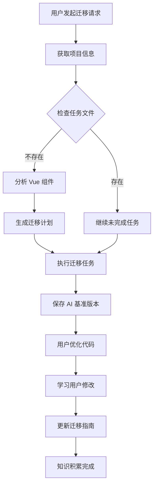

# Vue to React MCP

一个用于自动化 Vue 到 React 迁移的 MCP (Model Context Protocol) 服务器。通过智能分析和学习，帮助您高效地将 Vue 项目迁移到 React。

## ✨ 功能特性

- 🚀 **智能迁移规划**: 自动分析 Vue 组件并生成详细的 React 迁移计划
- 📚 **持续学习优化**: 智能学习迁移模式，从用户修改中提炼最佳实践
- 🔄 **任务管理**: 支持大型项目分阶段迁移，可暂停和继续
- 📝 **知识积累**: 自动维护 MIGRATION_GUIDE.md 知识库，沉淀迁移经验
- 🎯 **通用设计**: 适用于任何 Vue 到 React 项目，无特定框架依赖
- 💾 **基准对比**: 保存 AI 生成的基准版本，支持代码修改学习

## 📦 安装

使用 npm 全局安装：

```bash
npm install -g @jianger666/vue-to-react-mcp
```

或者使用 npx 直接运行：

```bash
npx @jianger666/vue-to-react-mcp --vue-project /path/to/vue --react-project /path/to/react
```

## ⚙️ 配置

Cursor配置

```json
{
  "mcpServers": {
    "vue-to-react": {
      "command": "npx",
      "args": [
        "@jianger666/vue-to-react-mcp",
        "--vue-project", "/path/to/vue/project",
        "--react-project", "/path/to/react/project"
      ]
    }
  }
}
```

### 参数说明

- `--vue-project`: Vue 项目的绝对路径
- `--react-project`: React 项目的绝对路径（目标项目）

## 🚀 使用方法

### 1. 开始迁移页面

通过自然语言告诉 AI 您想迁移的页面：

```
"帮我迁移用户管理页面"
"迁移 src/views/UserList.vue 到 React"
"将 Vue 的商品列表页面迁移到 React"
```

**AI 执行流程**：
1. 📊 获取项目信息和已有迁移指南
2. 🔍 分析 Vue 组件结构（模板、脚本、样式）
3. 📋 生成详细的迁移任务清单
4. ⚡ 逐步执行迁移任务
5. 💾 保存 AI 基准版本用于后续学习

### 2. 继续未完成的迁移

如果迁移过程中断，可以继续：

```
"继续之前的迁移任务"
"我想继续迁移"
```

### 3. 学习用户优化

当您完成代码优化后，让 AI 学习您的改动：

```
"我改好了代码，你学习一下吧"
"学习 src/pages/UserList 目录的改动"
"分析我对组件的修改并更新迁移指南"
```

**学习过程**：
1. 🔍 对比 AI 基准版本与用户修改版本
2. 📝 提炼通用的最佳实践和编码偏好
3. 📚 更新 MIGRATION_GUIDE.md 知识库
4. 🧠 为后续迁移提供更准确的指导

## 🔧 核心工具

| 工具名称 | 功能描述 |
|---------|---------|
| `get_from_application` | 获取项目信息，检查迁移任务状态 |
| `migrate_page` | 创建新的页面迁移任务 |
| `continue_migrate_page` | 继续执行未完成的迁移任务 |
| `save_ai_baseline` | 保存 AI 生成的代码基准版本 |
| `learn_from_changes` | 学习用户修改，更新迁移指南 |

## 📁 项目结构

迁移过程中会在 React 项目根目录创建以下文件：

```
your-react-project/
├── MIGRATION_GUIDE.md     # 迁移指南知识库
├── {文件名}_migrate_task.md # 当前迁移任务清单（按文件名区分）
└── .ai-baseline/          # AI 基准版本（自动清理）
    ├── 2024-01-15_14-30-25/
    └── 2024-01-15_15-45-12/
```

## 🎯 工作原理



## 🔍 最佳实践

1. **项目准备**: 确保 Vue 和 React 项目路径正确，React 项目已初始化
2. **分阶段迁移**: 大型项目建议按页面/模块逐步迁移
3. **及时学习**: 每次优化代码后让 AI 学习，提升后续迁移质量
4. **保持版本**: 重要节点建议手动备份，AI 基准版本会自动清理
5. **查看指南**: 定期查看 MIGRATION_GUIDE.md，了解积累的最佳实践

## 📊 版本信息

当前版本：**v1.0.6**

- ✅ 支持完整的 Vue 到 React 迁移流程
- ✅ 智能任务管理和续传功能
- ✅ 代码学习和知识积累
- ✅ 自动化构建和发布

## 🤝 贡献

欢迎提交 Issue 和 Pull Request！

- GitHub: https://github.com/jianger666/vue-to-react-mcp
- Issues: https://github.com/jianger666/vue-to-react-mcp/issues

